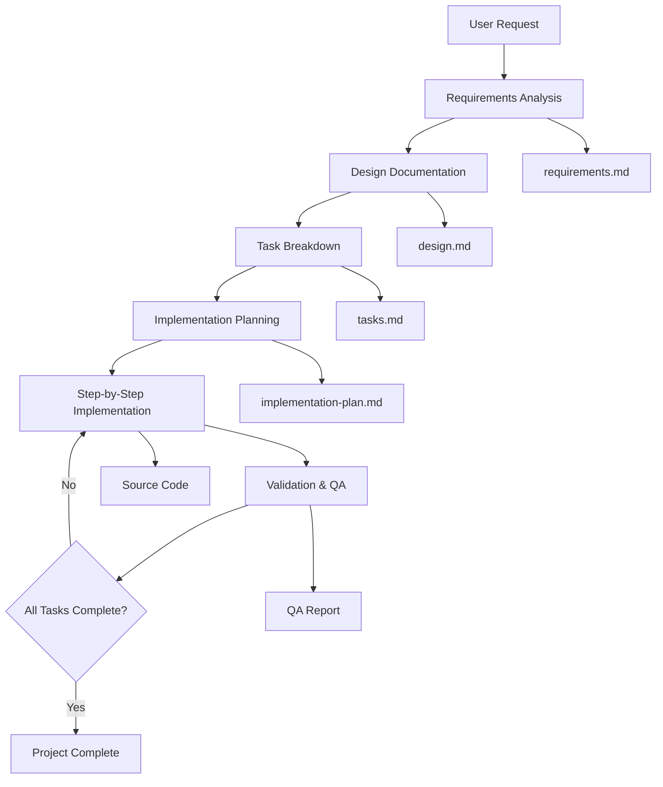

# 🎯 Activity Tracking System: Kiro-Style Development

[](LICENSE)
[](https://github.com/zicula/activity-tracking-system)
[](https://github.com/zicula/activity-tracking-system)

> 🚀 **Comprehensive user behavior tracking system with AI-driven development methodology**

## ภาพรวมโปรเจ็ค

โปรเจ็ค Activity-Tracking-System นี้พัฒนาขึ้นโดยใช้วิธีการ **Kiro-Style Development** ซึ่งเป็น approach ที่เน้นการสร้างเอกสารและความเป็นระเบียบ เลียนแบบการทำงานของ Kiro IDE จาก AWS

### 🎨 จุดเด่นของ Kiro-Style Approach:
- **Document-Driven Development** - เอกสารนำการพัฒนา
- **Step-by-Step Implementation** - ทำงานเป็นขั้นตอนชัดเจน
- **Consistency Validation** - ตรวจสอบความสอดคล้องอย่างเข้มงวด
- **Quality Assurance** - มีการ review และ validation ทุกขั้นตอน

---

## 📁 โครงสร้างโปรเจ็ค

```
activity-tracking-system/
├── 📖 Documentation & Guides
│   ├── kiro-style-prompts.md      # Instruction prompts หลัก
│   ├── kiro-example-usage.md      # ตัวอย่างการใช้งานแบบสมบูรณ์
│   ├── quick-start-guide.md       # คู่มือเริ่มต้นใช้งาน
│   └── README.md                  # ไฟล์นี้
│
├── 📋 Project Documents (จะสร้างตาม workflow)
│   ├── requirements.md           # ความต้องการของระบบ
│   ├── design.md                 # เอกสารออกแบบ
│   ├── tasks.md                  # แผนงานและ task breakdown
│   ├── implementation-plan.md    # แผนการ implement
│   └── security-requirements.md  # ความต้องการด้าน security
│
├── 💻 Source Code (จะสร้างตาม design)
│   ├── src/
│   ├── tests/
│   └── scripts/
│
└── 🔧 Configuration
    ├── .env.example
    └── docker-compose.yml
```

---

## 🚀 การเริ่มต้นใช้งาน

### Prerequisites:
- AI Assistant ที่รองรับ function calling (GitHub Copilot, Claude, GPT-4, etc.)
- ความเข้าใจเบื้องต้นเกี่ยวกับ software development lifecycle

### เริ่มต้น 3 ขั้นตอน:

1. **อ่านคู่มือ** 📚
   ```
   เริ่มต้นที่: quick-start-guide.md
   ```

2. **ตั้งค่า Master Prompt** ⚙️
   ```
   คัดลอก Master Prompt จาก: kiro-style-prompts.md
   ใส่เป็น system prompt ของ AI Assistant
   ```

3. **เริ่มต้นพัฒนา** 🏗️
   ```
   ใช้ template จาก quick-start-guide.md
   และทำตาม AI workflow
   ```

---

## 📖 ไฟล์สำคัญและการใช้งาน

### 🎯 `kiro-style-prompts.md`
**วัตถุประสงค์:** รวม instruction prompts ทั้งหมดสำหรับ Kiro-style development

**ประกอบด้วย:**
- Master Prompt (ใช้เป็น system prompt หลัก)
- Specialized Prompts (สำหรับงานเฉพาะขั้นตอน)
- Templates (สำหรับสร้างเอกสารมาตรฐาน)
- Validation Rules

**การใช้งาน:**
```
1. คัดลอก Master Prompt ไปใส่ใน AI Assistant
2. ใช้ Specialized Prompts เมื่อต้องการทำงานเฉพาะด้าน
3. ใช้ Templates สำหรับสร้างเอกสาร
```

### 🎪 `kiro-example-usage.md`
**วัตถุประสงค์:** แสดงตัวอย่างการใช้งานแบบครบวงจร

**ประกอบด้วย:**
- ตัวอย่างบทสนทนากับ AI ทั้ง 5 phase
- Input/Output ที่คาดหวัง
- การใช้งาน prompts ในสถานการณ์จริง
- Benefits และ best practices

**การใช้งาน:**
```
ใช้เป็นแนวทางและตัวอย่างในการพัฒนาโปรเจ็คจริง
```

### 🚀 `quick-start-guide.md`
**วัตถุประสงค์:** คู่มือเริ่มต้นใช้งานแบบรวดเร็ว

**ประกอบด้วย:**
- Checklist การเตรียมความพร้อม
- Templates สำเร็จรูป
- Quick commands
- Troubleshooting guide

**การใช้งาน:**
```
เริ่มต้นที่นี่เมื่อต้องการใช้งานครั้งแรก
```

---

## 🔄 Kiro Workflow สำหรับโปรเจ็คนี้



---

## 🎯 ตัวอย่างการใช้งานเร็ว

### สร้างโปรเจ็คใหม่:
```
Prompt: "ฉันต้องการสร้างระบบ Activity Tracking สำหรับติดตามกิจกรรมพนักงาน ใช้ Kiro workflow"

AI จะนำไปสู่:
1. การสร้าง requirements.md
2. การสร้าง design.md
3. การแตก tasks
4. การ implement ทีละขั้น
```

### เพิ่มฟีเจอร์ใหม่:
```
Prompt: "เพิ่มฟีเจอร์ real-time notifications ให้กับ Activity Tracking system ใช้ Kiro workflow"

AI จะ:
1. วิเคราะห์ impact กับระบบปัจจุบัน
2. อัพเดท requirements และ design
3. สร้าง tasks สำหรับฟีเจอร์ใหม่
4. ตรวจสอบ validation hooks
```

---

## 🛡️ Validation & Quality Assurance

### Validation Hooks ที่สำคัญ:
- **เมื่อแก้ไข API** → อัพเดทเอกสาร API
- **เมื่อแก้ไข UI** → อัพเดท test cases
- **เมื่อเพิ่ม feature** → อัพเดท requirements
- **เมื่อเปลี่ยน data model** → อัพเดท migration scripts

### Quality Standards:
- เอกสารและโค้ดต้องสอดคล้องกัน 100%
- Test coverage ต้องไม่ต่ำกว่า 85%
- ทุก API ต้องมี documentation
- ทุกการเปลี่ยนแปลงต้องผ่าน review process

---

## 🎨 การปรับแต่งสำหรับโปรเจ็คอื่น

### วิธีการนำไปใช้กับโปรเจ็คอื่น:

1. **แก้ไข Master Prompt**
   ```
   เปลี่ยนชื่อโปรเจ็คจาก "activity-tracking-system" เป็นชื่อโปรเจ็คของคุณ
   ปรับ domain-specific requirements
   ```

2. **ปรับ Validation Rules**
   ```
   เพิ่ม validation rules ที่เฉพาะสำหรับโดเมนของคุณ
   กำหนด quality standards ที่เหมาะสม
   ```

3. **แก้ไข Templates**
   ```
   ปรับ templates ให้เหมาะกับประเภทโปรเจ็ค
   เพิ่มเซ็คชั่นที่จำเป็น
   ```

---

## 📈 Benefits ของ Kiro-Style Approach

### ✅ ข้อดี:
- **ลดข้อผิดพลาด** - การทำงานเป็นขั้นตอนชัดเจน
- **เอกสารครบถ้วน** - มีเอกสารรองรับทุกส่วน
- **คุณภาพสูง** - มีการ validation และ review
- **ง่ายต่อการบำรุงรักษา** - เอกสารและโค้ดสอดคล้องกัน
- **เหมาะกับทีมงาน** - มีมาตรฐานเดียวกัน

### ⚠️ ข้อควรระวัง:
- **ใช้เวลามากขึ้น** - ต้องสร้างเอกสารก่อนเขียนโค้ด
- **ต้องมีวินัย** - ต้องทำตามขั้นตอนอย่างเข้มงวด
- **Learning curve** - ต้องเรียนรู้วิธีการใหม่

---

---

## 🤝 การมีส่วนร่วม (Contributing)

เรายินดีรับการมีส่วนร่วมจากชุมชน! ไม่ว่าจะเป็น:

### 🎯 **วิธีการมีส่วนร่วม:**
- 🐛 **รายงานปัญหา:** สร้าง GitHub Issues
- 💡 **เสนอแนวคิด:** สร้าง Feature Requests  
- 📖 **ปรับปรุงเอกสาร:** ส่ง Pull Requests
- 🔧 **พัฒนาโค้ด:** ทำตาม Kiro methodology

### 📋 **ขั้นตอนการ Contribute:**

1. **Fork Repository**
   ```bash
   # คลิก Fork บน GitHub
   git clone https://github.com/YOUR_USERNAME/activity-tracking-system.git
   ```

2. **สร้าง Feature Branch**
   ```bash
   git checkout -b feature/your-feature-name
   ```

3. **ทำตาม Kiro Workflow**
   ```
   1. อัพเดท requirements.md (ถ้าจำเป็น)
   2. อัพเดท design.md (ถ้าจำเป็น)
   3. เพิ่ม tasks ใน tasks.md
   4. Implement ตาม implementation-plan.md
   5. เขียน tests และ documentation
   ```

4. **Submit Pull Request**
   ```bash
   git commit -m "✨ Add your feature description"
   git push origin feature/your-feature-name
   # สร้าง Pull Request บน GitHub
   ```

### 📚 **หลักเกณฑ์การ Contribute:**
- ✅ ทำตาม [Kiro Methodology](kiro-style-prompts.md)
- ✅ เขียน documentation ครบถ้วน
- ✅ เพิ่ม tests สำหรับ feature ใหม่
- ✅ ใช้ commit message ที่ชัดเจน
- ✅ รักษา code quality standards

### วิธีการปรับปรุงและพัฒนา:

1. **ปรับปรุง Prompts**
   ```
   แก้ไขไฟล์ kiro-style-prompts.md
   เพิ่ม specialized prompts สำหรับกรณีใหม่
   ```

2. **เพิ่มตัวอย่าง**
   ```
   เพิ่มตัวอย่างการใช้งานใน kiro-example-usage.md
   สร้างตัวอย่างสำหรับโดเมนใหม่
   ```

3. **ปรับปรุง Templates**
   ```
   แก้ไข templates ให้ครอบคลุมมากขึ้น
   เพิ่ม validation rules ใหม่
   ```

---

## 📞 การสนับสนุน

### หากมีปัญหาหรือคำถาม:

1. **ตรวจสอบ** `quick-start-guide.md` ส่วน Troubleshooting
2. **ดูตัวอย่าง** ใน `kiro-example-usage.md`
3. **อ่าน** documentation ใน `kiro-style-prompts.md`

### เคล็ดลับการใช้งาน:
- เริ่มต้นด้วย requirements เสมอ
- อย่าข้าม validation steps
- ใช้ templates เพื่อความรวดเร็ว
- ตรวจสอบ consistency เป็นประจำ

---

## 📜 License

โปรเจ็คนี้อยู่ภายใต้ [MIT License](LICENSE) สามารถนำไปใช้งาน แก้ไข และแจกจ่ายได้อย่างเสรี

---

## 🔗 Links

- 📦 **GitHub Repository:** https://github.com/zicula/activity-tracking-system
- 📖 **Documentation:** [Quick Start Guide](quick-start-guide.md)
- 🎯 **Methodology:** [Kiro-Style Prompts](kiro-style-prompts.md)
- 🎪 **Examples:** [Usage Examples](kiro-example-usage.md)

---

## 🎉 เริ่มต้นการใช้งาน

พร้อมแล้วที่จะเริ่มต้นพัฒนาแบบ Kiro-style! 

👉 **เริ่มต้นที่:** `quick-start-guide.md`

---

*พัฒนาด้วย ❤️ ตาม Kiro IDE Methodology*
